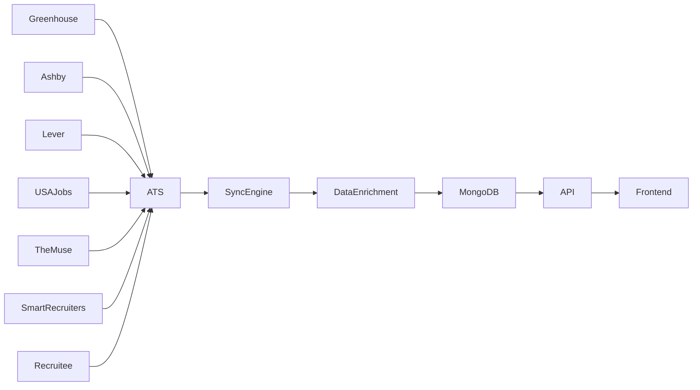
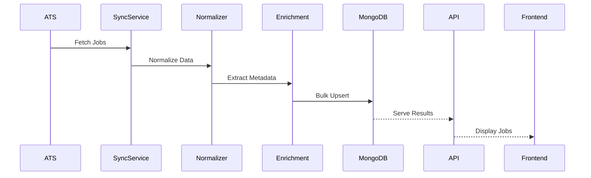

<div align="center">

# 🚀 JobsAPI
### It is just an Test setup not depicting Real Product crafted to check on different resources

<p align="center">
  
  
  
  
  
  
</p>

<p align="center">
  
  
  
  
</p>

---

### 🌎 Aggregating Thousands of US Jobs Across Multiple ATS Platforms

Find internships, new-grad roles, full-time opportunities, remote jobs, and government positions from a single unified search experience.

</div>

---

# 📖 Overview

JobsAPI is a large-scale job aggregation platform built to collect, normalize, enrich, classify, and serve job opportunities from multiple Applicant Tracking Systems (ATS).

The platform is specifically designed for:

- 🇺🇸 US Job Seekers
- 🎓 Students
- 👨‍💻 Software Engineers
- 🚀 New Graduates
- 🏢 Experienced Professionals
- 💼 Government Job Applicants

Unlike traditional job boards, JobsAPI continuously synchronizes data directly from ATS providers and normalizes job information into a unified schema.

---

# ✨ Features

## 🔍 Advanced Job Search

Search jobs using:

- Role
- Company
- Location
- Job Type
- Experience Level
- Remote Status
- ATS Source
- Date Posted

---


## 🏠 Remote Job Classification

Classifies jobs into:

- US Remote
- Hybrid
- On-Site
- International Remote

---

## 🧠 AI-Powered Data Enrichment

Extracts:

- Skills
- Salary Information
- State
- Country
- Location Metadata
- Employment Type
- Experience Level

---

## ⚡ High Performance Sync Engine

Supports:

- Parallel Syncing
- Bulk MongoDB Operations
- Automatic Deduplication
- Job Hashing
- Retry Mechanisms

---

# 🏗 System Architecture



---

# 📦 Supported ATS Platforms

| Platform | Status |
|-----------|---------|
| Greenhouse | ✅ |
| Ashby | ✅ |
| Lever | ✅ |
| USAJobs | ✅ |
| TheMuse | ✅ |
| SmartRecruiters | ✅ |
| Recruitee | ✅ |
| Arbeitnow | ✅ |
| Remotive | ✅ |
| Workday | 🚧 |
| BambooHR | 🚧 |
| Teamtailor | 🚧 |
| Jobvite | 🚧 |

---

# 📂 Project Structure

```bash
jobsapi/
│
├── backend/
│   ├── src/
│   │   ├── config/
│   │   ├── controllers/
│   │   ├── cron/
│   │   ├── models/
│   │   ├── routes/
│   │   ├── services/
│   │   ├── scripts/
│   │   ├── utils/
│   │   └── server.js
│   │
│   └── package.json
│
├── frontend/
│   ├── src/
│   │   ├── components/
│   │   ├── pages/
│   │   ├── services/
│   │   └── App.jsx
│   │
│   └── package.json
│
└── README.md
```

---

# ⚙️ Backend Stack

```yaml
Runtime:
  - Node.js

Framework:
  - Express.js

Database:
  - MongoDB Atlas

ODM:
  - Mongoose

Logging:
  - Winston

Documentation:
  - Swagger

Scheduling:
  - Node Cron

HTTP:
  - Axios
```

---

# 🎨 Frontend Stack

```yaml
Frontend:
  - React

Bundler:
  - Vite

State Management:
  - React Hooks

HTTP:
  - Axios

Styling:
  - CSS
```

---

# 🗄 Database Design

## Jobs Collection

```js
{
  title,
  company,
  location,
  source,
  applyUrl,
  description,
  postedAt,
  remote,
  salary,
  skills,
  state,
  country,
  employmentType,
  experienceLevel,
  jobHash
}
```

---

# 🔄 Synchronization Workflow



---

# 🚀 Installation

## Clone Repository

```bash
git clone https://github.com/YOUR_USERNAME/jobsapi.git

cd jobsapi
```

---

## Backend Setup

```bash
cd backend

npm install
```

Create:

```env
PORT=5000

MONGO_URI=

USAJOBS_API_KEY=

USAJOBS_EMAIL=
```

Run:

```bash
npm run dev
```

---

## Frontend Setup

```bash
cd frontend

npm install

npm run dev
```

---

# 📡 API Endpoints

## Jobs

```http
GET /api/jobs/search
```

### Query Parameters

```http
?page=
?limit=
?role=
?location=
?company=
?jobType=
?experienceLevel=
?remote=
?source=
```

---

## Stats

```http
GET /api/stats
```

Returns:

```json
{
  "totalJobs": 8600,
  "sources": 9,
  "remoteJobs": 3200
}
```

---

## Manual Sync

```http
POST /api/jobs/sync
```

Triggers synchronization across all ATS providers.

---

# 🔐 Environment Variables

```env
PORT=5000

NODE_ENV=production

MONGO_URI=

USAJOBS_API_KEY=

USAJOBS_EMAIL=
```

---

# 📊 Performance

Current Production Metrics:

| Metric | Value |
|----------|--------|
| Jobs Indexed | 8,000+ |
| ATS Sources | 9 |
| Average Sync Time | < 20 sec |
| Search Response | < 500 ms |
| Database | MongoDB Atlas |

---

# 🧪 Future Roadmap

## Phase 1

- ATS Aggregation
- Search Engine
- Filtering

## Phase 2

- Resume Matching
- ATS Score
- Job Recommendations

## Phase 3

- AI Career Copilot
- Auto Apply Agent
- Resume Optimizer

---

# 👨‍💻 Author

## Priyanshu Singh

- Backend Development
- ATS Integrations
- Job Aggregation Systems
- AI Products
- MLOps

---

# 🌟 Support

If you found this project useful:

⭐ Star the repository

🍴 Fork the repository

🛠 Contribute improvements

📢 Share with others

---

<div align="center">

### Built with ❤️ by Priyanshu Singh

</div>
