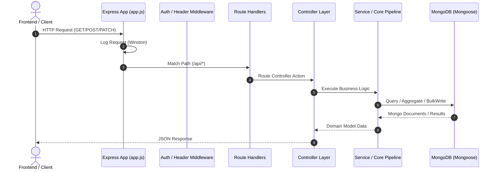
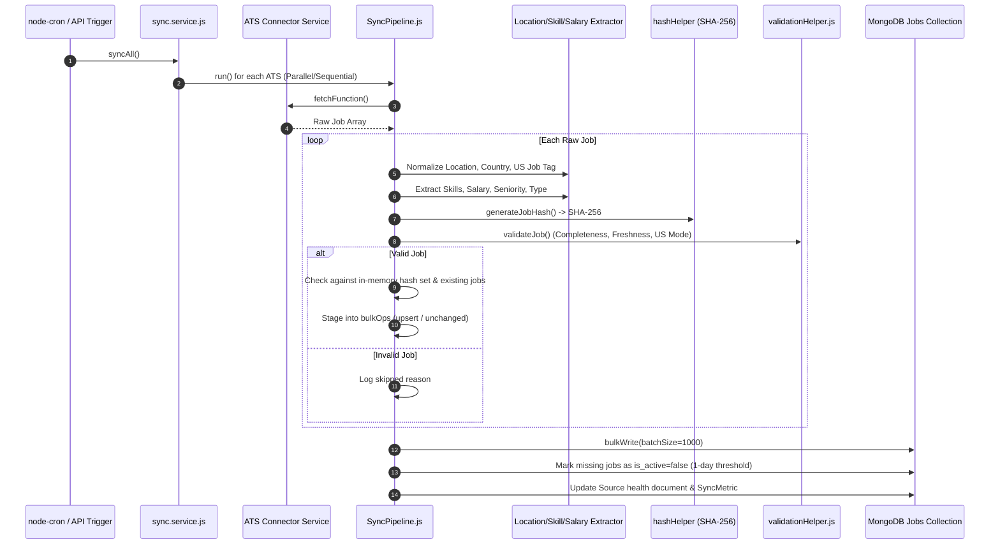
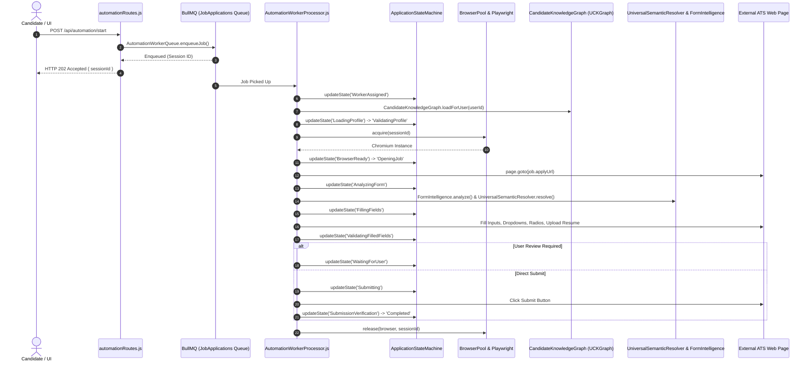
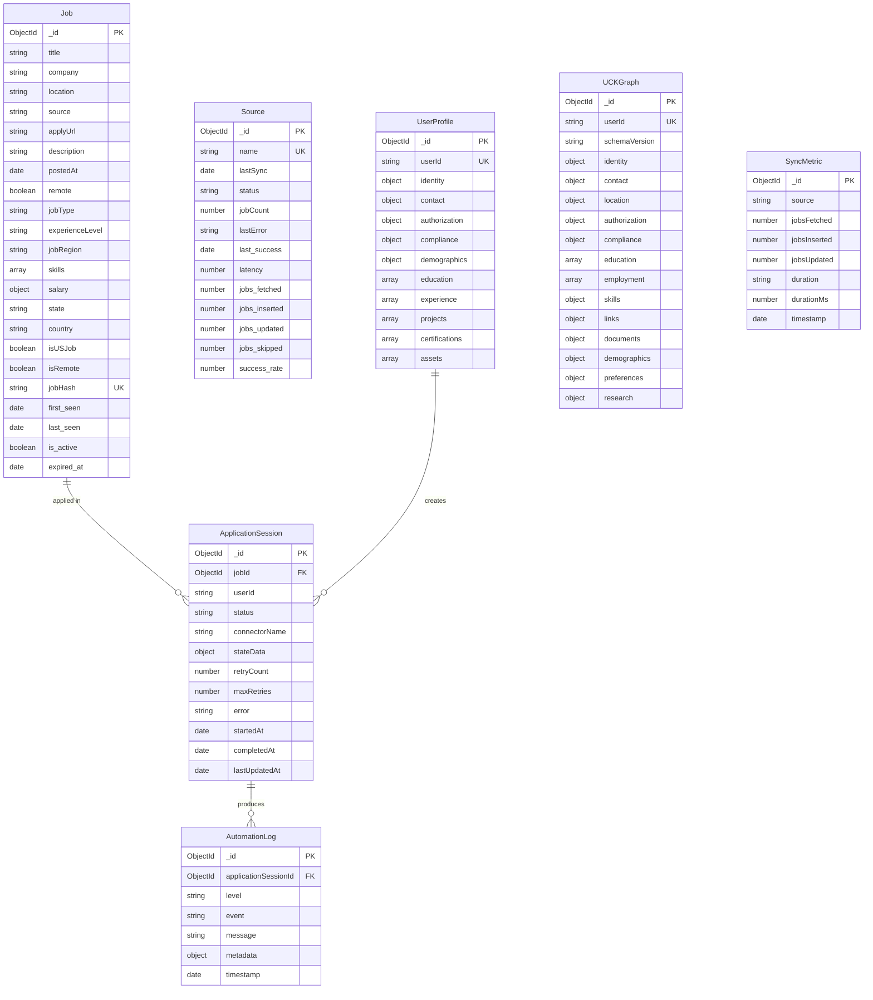

# 🏗️ JobsAPI — Comprehensive Architecture Audit

**Document Version:** 1.0.0  
**Audit Date:** 2026-09-24  
**Auditor:** Senior Staff Architect & Principal Systems Engineer  
**Repository:** `PriyanshuSingh10114/jobsapi-test` / `JobsAPI`

---

## 1. Executive Summary

**JobsAPI** is a high-throughput job ingestion, normalization, search engine, and robotic application automation platform. It harvests candidate job postings from **13+ Applicant Tracking Systems (ATS)**, extracts structured metadata (skills, compensation, regional classification, seniorities), indexes deduplicated postings in MongoDB, and provides an end-to-end autonomous application worker powered by Playwright and governed by a Candidate Knowledge Graph (UCKGraph).

While the foundational architecture demonstrates sophisticated domain engineering—such as dynamic ATS selector detection, state machine orchestration, and candidate knowledge graph modeling—the system contains several **critical architectural, security, and production-readiness gaps** that must be resolved for enterprise production deployment.

---

## 2. Actual System Flows

### 2.1 Actual Request Flow (API)


### 2.2 Actual Data Ingestion Flow (Sync Pipeline)


### 2.3 Actual Queue & Auto-Apply Flow


---

## 3. Database Model Relationships



---

## 4. Priority Classification Matrix (P0 - P3)

| Priority | Level | Definition | Impact |
| :--- | :--- | :--- | :--- |
| **P0** | **Critical** | Immediate security vulnerability, crash risk, data corruption, or unhandled failure loop. | System down, data breach, unbounded resource exhaustion. |
| **P1** | **High** | Architectural flaw, missing validation, unbounded concurrency, lack of idempotency, broken error handling. | Production instability, memory leaks, duplicate operations. |
| **P2** | **Medium** | Missing observability, performance bottlenecks, unindexed queries, technical debt. | Degraded performance, blind debugging. |
| **P3** | **Low** | Minor documentation drifts, style inconsistencies, cleanups. | Developer ergonomics. |

---

## 5. Detailed Findings & Gap Analysis

### 5.1 Critical (P0) & High (P1) Priority Issues

#### [P0-1] Environment Variable Discrepancy & Lack of Fail-Fast Validation
- **Finding:** Inconsistent use of `MONGO_URI` vs `MONGODB_URI` across scripts, README, and `db.js`.
- **Impact:** In Docker and staging/production deployments, scripts or API may silently fail to connect or crash abruptly.
- **Fix:** Standardize strictly on `MONGODB_URI` with a centralized, fail-fast configuration validator.

#### [P0-2] Missing Authentication & Unprotected Sensitive Endpoints
- **Finding:** No authentication or authorization middleware is active on routes. Sensitive actions (`POST /api/jobs/sync`, `POST /api/automation/start`, `PATCH /api/user/profile`, `POST /api/user/resume`) use hardcoded `DEFAULT_USER_ID = 'local_admin_1'`.
- **Impact:** Any unauthenticated caller can trigger expensive bulk synchronizations or launch unlimited Playwright browser instances, causing Denial of Service.
- **Fix:** Implement a role-aware authentication and authorization layer (`USER`, `ADMIN`, `SYSTEM/WORKER`) with a local development fallback.

#### [P0-3] Unrestricted File Uploads & Local Path Traversal Risk
- **Finding:** Resume uploads in `userRoutes.js` accept files directly and store absolute filesystem paths (`absolutePath`) in candidate profile documents.
- **Impact:** Internal server directory structures are leaked via API responses. Potential path traversal if filename sanitization fails.
- **Fix:** Abstract file storage behind a dedicated `StorageService`, generate cryptographic UUID storage filenames, strictly validate MIME/magic bytes, and return sanitized relative URLs.

#### [P1-1] Unbounded Regex Injection in Job Search (`buildJobFilter`)
- **Finding:** User query parameters (`company`, `location`, `jobType`) are directly passed to `new RegExp(param, 'i')` without escaping regex special characters.
- **Impact:** Regular Expression Denial of Service (ReDoS) or 500 crashes when users enter characters like `(`, `[`, or `*`.
- **Fix:** Sanitize and escape all regex inputs in `filterBuilder.js` and introduce strict query parameter validation.

#### [P1-2] Overlapping Cron Execution & Lack of Concurrency Mutex
- **Finding:** The 6-hour sync cron job triggers `syncAll()` without checking if a previous sync cycle is still running.
- **Impact:** If an ATS experiences network timeouts and sync runs long, subsequent cron triggers create concurrent overlapping ingestion runs, leading to database lock contention and duplicate work.
- **Fix:** Implement an in-memory/distributed lock mutex guard around sync execution.

#### [P1-3] State Machine Resumability & Worker Crash Recovery
- **Finding:** If a worker crashes mid-automation while in state `FillingFields` or `Submitting`, the session remains stuck indefinitely unless a watchdog recovers it.
- **Impact:** Orphaned browser sessions and stuck applications.
- **Fix:** Implement timeout watchdogs, explicit failure states (`FAILED`, `CANCELLED`, `RETRY_PENDING`), and idempotency checks before form submission.

#### [P1-4] Playwright Zombie Process Prevention & Resource Limiting
- **Finding:** While `BrowserPool` has a basic pool array, unhandled worker exceptions during page execution could potentially orphan browser contexts.
- **Impact:** Memory exhaustion from lingering Chromium headless instances on the worker host.
- **Fix:** Enforce strict try/finally resource cleanup blocks in worker processors, context-level timeout limits, and graceful shutdown signal handlers (`SIGTERM`, `SIGINT`).

---

## 6. Recommended Target Architecture

```
jobsapi/
├── backend/
│   ├── src/
│   │   ├── config/              # Centralized typed & validated config schemas
│   │   ├── middleware/          # Auth, Validation, Correlation, Error, Rate Limiting
│   │   ├── errors/              # Typed Application Error Hierarchy
│   │   ├── controllers/         # Thin, declarative HTTP controllers
│   │   ├── services/            # Pure domain & business logic
│   │   ├── repositories/        # Database access layer
│   │   ├── models/              # Mongoose schemas & compound indexes
│   │   ├── core/                # Ingestion pipeline & HTTP client
│   │   ├── automation/          # Playwright RPA engine & UCKGraph
│   │   └── utils/               # Sanitizers, normalizers & helpers
│   └── tests/                   # Unit, Integration & Mocked Automation suites
├── frontend/                    # Vite + React 19 + Tailwind CSS + TanStack Query
└── docs/                        # Complete architectural and operational documentation
```

---

## 7. Action Plan by Phase

- [x] **Phase 0:** Deep Repository Audit & `docs/ARCHITECTURE_AUDIT.md` (Completed)
- [ ] **Phase 1:** Configuration Standardization (`MONGODB_URI`, fail-fast config module)
- [ ] **Phase 2:** Backend Architecture (Typed Errors, Centralized Express Error Handler, Request ID)
- [ ] **Phase 3:** Request Validation & NoSQL/ReDoS Injection Defense
- [ ] **Phase 4:** API Security (Auth layer, Rate Limiting, Helmet, Secure CORS)
- [ ] **Phase 5:** MongoDB Audit & Compound Index Optimization
- [ ] **Phase 6:** Ingestion Pipeline Hardening & Independent Connector Isolation
- [ ] **Phase 7:** BullMQ Queue Separation, Idempotency & Graceful Shutdown
- [ ] **Phase 8:** Playwright Resource Limits & Zombie Leak Prevention
- [ ] **Phase 9:** Auto-Apply State Machine Audit & Explicit Failure States
- [ ] **Phase 10:** UCKGraph Integrity & Zero Candidate Data Hallucination
- [ ] **Phase 11:** ATS Connector Interfaces & Health Telemetry
- [ ] **Phase 12:** Observability (`/health`, `/health/ready`, Structured Logging)
- [ ] **Phase 13:** File Upload Security & Storage Abstraction
- [ ] **Phase 14:** Frontend Architecture & Query Client Optimization
- [ ] **Phase 15:** Search Performance & Capped Pagination
- [ ] **Phase 16:** Cron Scheduler Distributed Locking
- [ ] **Phase 17 & 18:** Testing Suite & Failure Simulation
- [ ] **Phase 19:** Deployment Architecture (Docker & Docker Compose)
- [ ] **Phase 20:** Dedicated Security Review & `docs/SECURITY_AUDIT.md`
- [ ] **Phase 21:** Comprehensive Documentation Suite
- [ ] **Phase 22:** Final Validation & Verification
